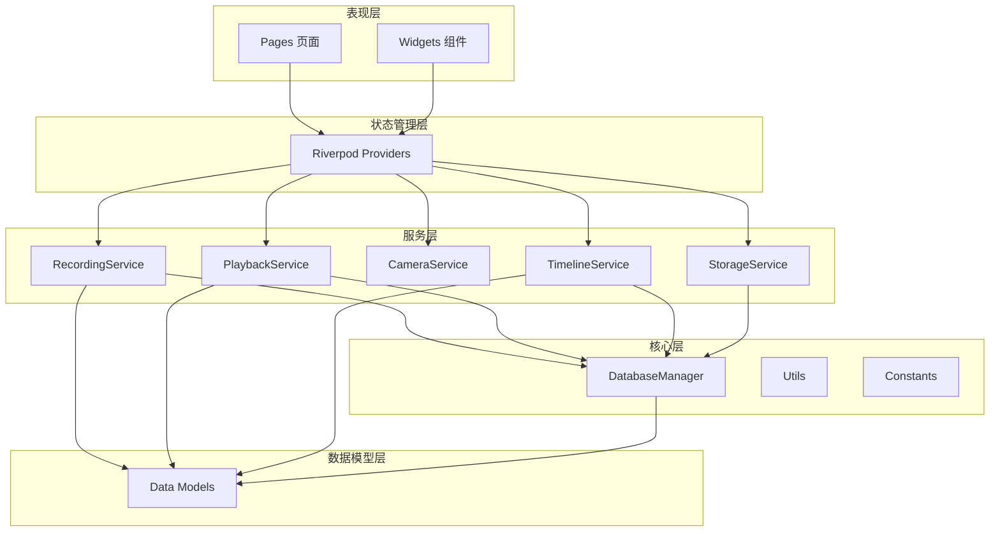
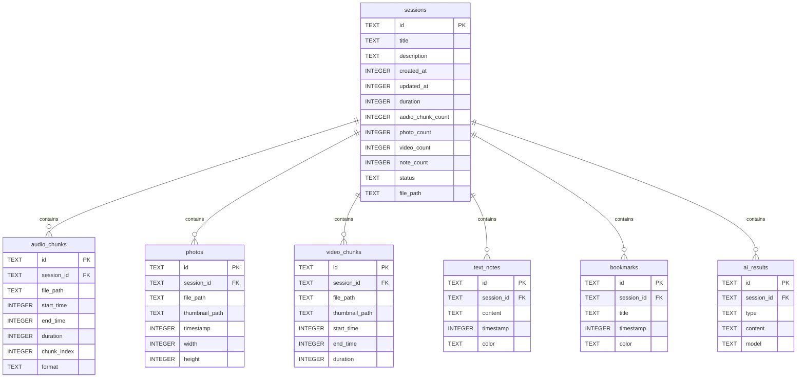
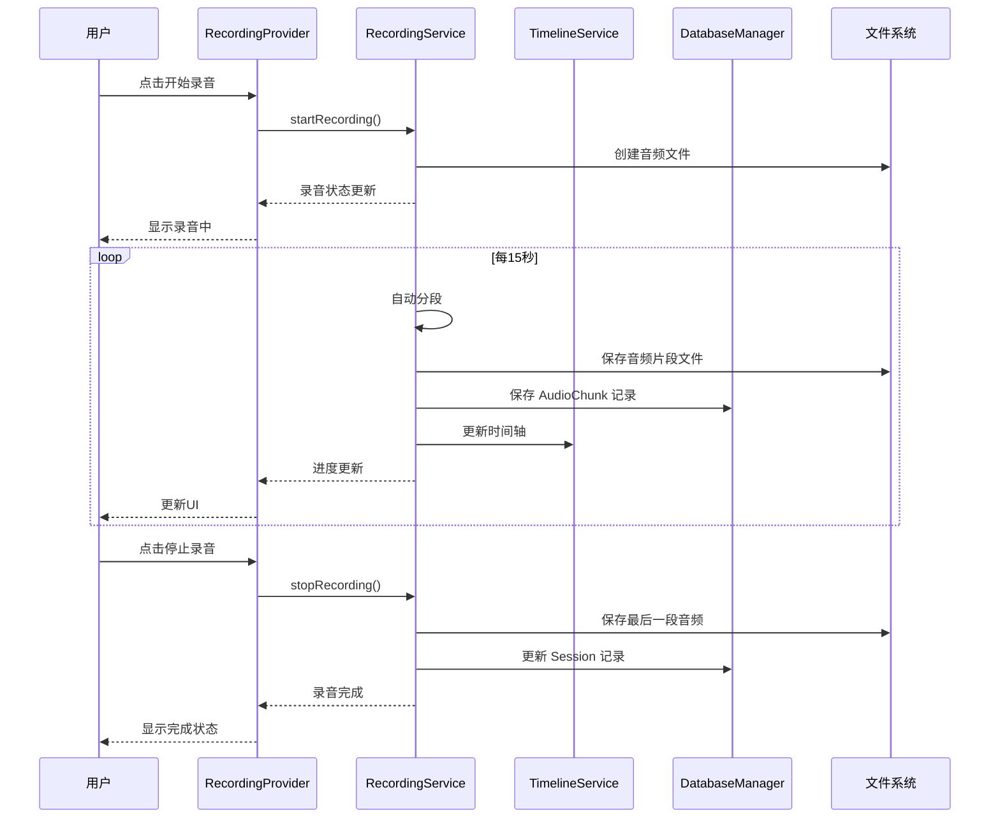
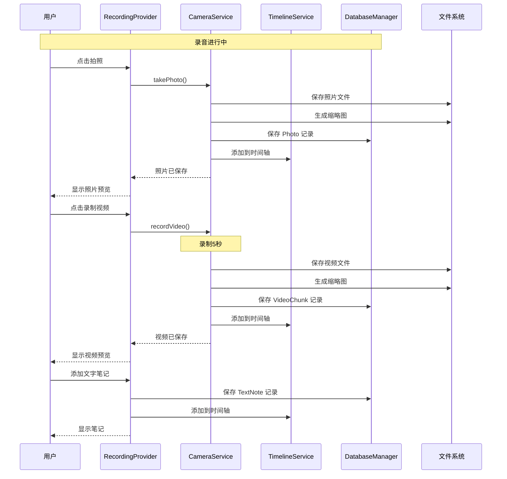
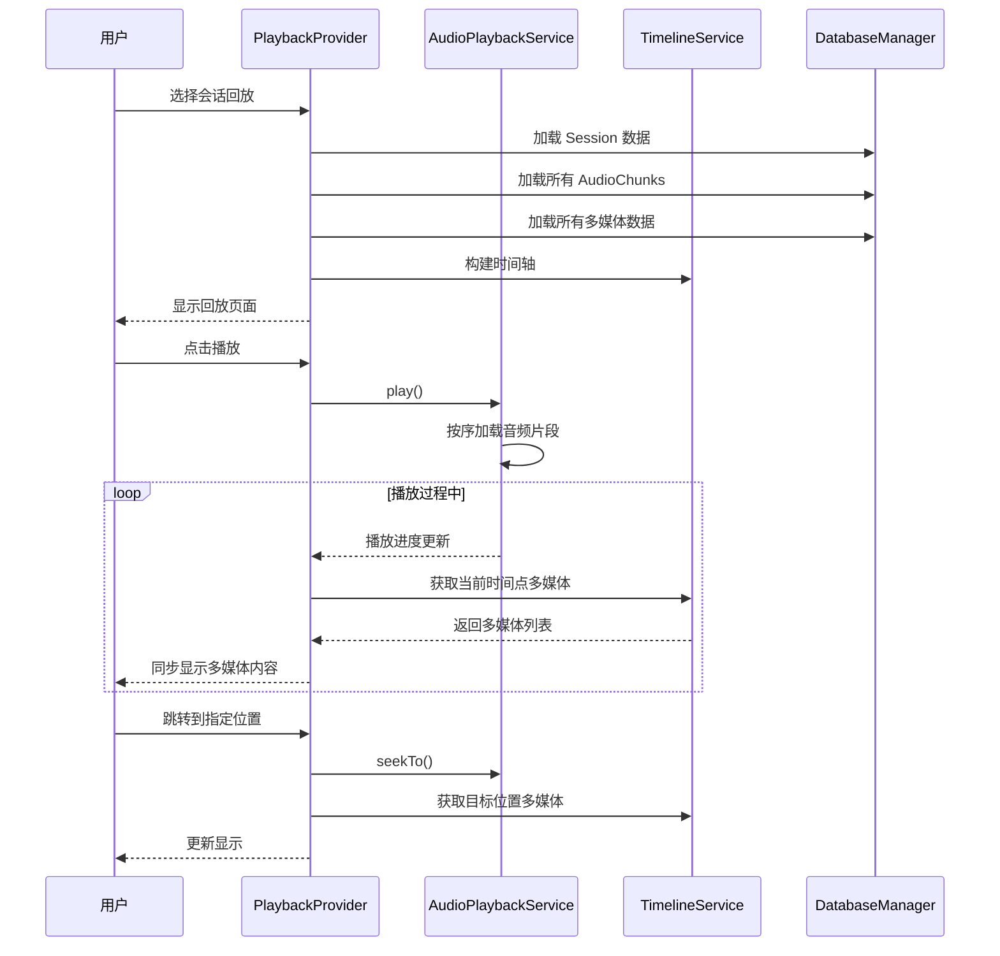
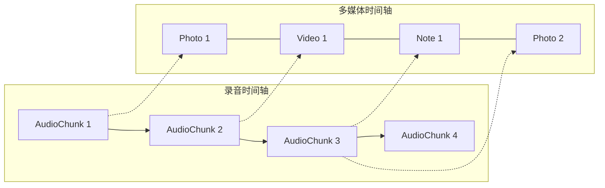

# Recaping - 架构设计文档

> 作者：GDNDZZK  
> 创建日期：2026-04-09  
> 最后更新：2026-04-09

---

## 1. 概述

Recaping 采用分层架构设计，将应用分为核心层、数据模型层、服务层、状态管理层和表现层。各层之间通过明确的接口进行通信，确保代码的可维护性和可测试性。

### 1.1 设计原则

- **单一职责**：每个类/模块只负责一个功能
- **依赖注入**：通过 Riverpod 实现依赖注入
- **关注点分离**：UI、业务逻辑、数据存储相互独立
- **可测试性**：核心逻辑不依赖平台特定实现

### 1.2 架构总览



---

## 2. 技术选型

### 2.1 核心框架

| 技术 | 选型 | 版本 | 说明 |
|-----|------|------|------|
| 框架 | Flutter | 3.x | 跨平台 UI 框架 |
| 语言 | Dart | 3.x | 类型安全，空安全支持 |
| 数据库 | sqflite | ^2.3.0 | SQLite for Flutter |
| 状态管理 | flutter_riverpod | ^2.4.0 | 类型安全的状态管理 |

### 2.2 功能库

| 功能 | 选型 | 说明 |
|-----|------|------|
| 音频录制 | record | 简单易用，支持多种格式 |
| 音频播放 | just_audio | 功能完善，支持流播放 |
| 相机 | image_picker | 系统相机，兼容性好 |
| 路由 | go_router | 声明式路由，深链接支持 |
| 文件路径 | path_provider | 跨平台文件路径 |
| 权限 | permission_handler | 统一权限管理 |

### 2.3 开发工具

| 工具 | 选型 | 说明 |
|-----|------|------|
| 代码分析 | flutter_lints | 推荐的 lint 规则 |
| 测试 | flutter_test | 单元测试和 Widget 测试 |
| 序列化 | json_serializable | JSON 序列化代码生成 |

---

## 3. 目录结构

```
lib/
├── main.dart                          # 应用入口，初始化
├── app.dart                           # MaterialApp 配置和路由
│
├── core/                              # 核心层 - 不依赖业务逻辑
│   ├── constants/                     # 常量定义
│   │   ├── app_constants.dart         # 应用常量
│   │   ├── database_constants.dart    # 数据库常量
│   │   └── audio_constants.dart       # 音频常量
│   ├── extensions/                    # Dart 扩展方法
│   │   ├── context_extension.dart     # BuildContext 扩展
│   │   ├── datetime_extension.dart    # DateTime 扩展
│   │   └── duration_extension.dart    # Duration 扩展
│   ├── utils/                         # 工具类
│   │   ├── file_utils.dart            # 文件操作工具
│   │   ├── permission_utils.dart      # 权限工具
│   │   └── date_utils.dart            # 日期工具
│   └── database/                      # 数据库核心
│       ├── database_manager.dart      # 数据库管理器（连接、迁移）
│       ├── session_database.dart      # 会话表操作
│       ├── audio_chunk_database.dart  # 音频片段表操作
│       ├── media_database.dart        # 媒体表操作（照片、视频）
│       ├── note_database.dart         # 笔记表操作
│       └── config_database.dart       # 配置表操作
│
├── models/                            # 数据模型层
│   ├── session.dart                   # 录音会话
│   ├── audio_chunk.dart               # 音频片段
│   ├── photo.dart                     # 照片
│   ├── video_chunk.dart               # 视频片段
│   ├── text_note.dart                 # 文字笔记
│   ├── bookmark.dart                  # 书签
│   ├── ai_result.dart                 # AI 处理结果
│   └── timeline_item.dart             # 时间轴项（统一接口）
│
├── services/                          # 业务服务层
│   ├── recording_service.dart         # 录音服务
│   ├── audio_playback_service.dart    # 音频播放服务
│   ├── camera_service.dart            # 相机服务
│   ├── timeline_service.dart          # 时间轴服务
│   └── storage_service.dart           # 存储管理服务
│
├── providers/                         # 状态管理层（Riverpod）
│   ├── recording_provider.dart        # 录音状态
│   ├── session_provider.dart          # 会话状态
│   ├── playback_provider.dart         # 播放状态
│   ├── timeline_provider.dart         # 时间轴状态
│   └── settings_provider.dart         # 设置状态
│
├── pages/                             # 页面
│   ├── home/                          # 会话列表页
│   │   ├── home_page.dart
│   │   └── widgets/
│   ├── record/                        # 录音页面
│   │   ├── record_page.dart
│   │   └── widgets/
│   ├── playback/                      # 回放页面
│   │   ├── playback_page.dart
│   │   └── widgets/
│   ├── settings/                      # 设置页面
│   │   └── settings_page.dart
│   └── ai/                            # AI 功能页面
│       └── ai_page.dart
│
└── widgets/                           # 通用组件
    ├── timeline/                      # 时间轴组件
    │   ├── timeline_widget.dart
    │   ├── audio_timeline.dart
    │   └── media_timeline.dart
    ├── audio/                         # 音频相关组件
    │   ├── audio_waveform.dart
    │   └── audio_controls.dart
    ├── recording_controls/            # 录音控制组件
    │   ├── record_button.dart
    │   └── media_action_buttons.dart
    └── common/                        # 通用 UI 组件
        ├── app_bar.dart
        └── loading_indicator.dart
```

---

## 4. 数据库设计

### 4.1 表结构

#### sessions 表 - 录音会话

| 字段 | 类型 | 约束 | 说明 |
|-----|------|------|------|
| id | TEXT | PRIMARY KEY | UUID |
| title | TEXT | NOT NULL | 会话标题 |
| description | TEXT | | 会话描述 |
| created_at | INTEGER | NOT NULL | 创建时间（毫秒时间戳） |
| updated_at | INTEGER | NOT NULL | 更新时间 |
| duration | INTEGER | DEFAULT 0 | 总时长（毫秒） |
| audio_chunk_count | INTEGER | DEFAULT 0 | 音频片段数量 |
| photo_count | INTEGER | DEFAULT 0 | 照片数量 |
| video_count | INTEGER | DEFAULT 0 | 视频数量 |
| note_count | INTEGER | DEFAULT 0 | 笔记数量 |
| status | TEXT | DEFAULT 'active' | 状态：active/archived/deleted |
| file_path | TEXT | | 会话文件路径 |

#### audio_chunks 表 - 音频片段

| 字段 | 类型 | 约束 | 说明 |
|-----|------|------|------|
| id | TEXT | PRIMARY KEY | UUID |
| session_id | TEXT | FOREIGN KEY | 所属会话 |
| file_path | TEXT | NOT NULL | 音频文件路径 |
| start_time | INTEGER | NOT NULL | 开始时间（相对于会话开始的毫秒偏移） |
| end_time | INTEGER | NOT NULL | 结束时间 |
| duration | INTEGER | NOT NULL | 片段时长 |
| chunk_index | INTEGER | NOT NULL | 片段序号 |
| format | TEXT | DEFAULT 'm4a' | 音频格式 |
| sample_rate | INTEGER | DEFAULT 44100 | 采样率 |
| created_at | INTEGER | NOT NULL | 创建时间 |

#### photos 表 - 照片

| 字段 | 类型 | 约束 | 说明 |
|-----|------|------|------|
| id | TEXT | PRIMARY KEY | UUID |
| session_id | TEXT | FOREIGN KEY | 所属会话 |
| file_path | TEXT | NOT NULL | 照片文件路径 |
| thumbnail_path | TEXT | | 缩略图路径 |
| timestamp | INTEGER | NOT NULL | 拍摄时间（相对于会话开始的毫秒偏移） |
| width | INTEGER | | 图片宽度 |
| height | INTEGER | | 图片高度 |
| file_size | INTEGER | | 文件大小 |
| created_at | INTEGER | NOT NULL | 创建时间 |

#### video_chunks 表 - 视频片段

| 字段 | 类型 | 约束 | 说明 |
|-----|------|------|------|
| id | TEXT | PRIMARY KEY | UUID |
| session_id | TEXT | FOREIGN KEY | 所属会话 |
| file_path | TEXT | NOT NULL | 视频文件路径 |
| thumbnail_path | TEXT | | 缩略图路径 |
| start_time | INTEGER | NOT NULL | 开始时间（相对于会话开始的毫秒偏移） |
| end_time | INTEGER | NOT NULL | 结束时间 |
| duration | INTEGER | NOT NULL | 片段时长 |
| width | INTEGER | | 视频宽度 |
| height | INTEGER | | 视频高度 |
| file_size | INTEGER | | 文件大小 |
| created_at | INTEGER | NOT NULL | 创建时间 |

#### text_notes 表 - 文字笔记

| 字段 | 类型 | 约束 | 说明 |
|-----|------|------|------|
| id | TEXT | PRIMARY KEY | UUID |
| session_id | TEXT | FOREIGN KEY | 所属会话 |
| content | TEXT | NOT NULL | 笔记内容 |
| timestamp | INTEGER | NOT NULL | 创建时间（相对于会话开始的毫秒偏移） |
| color | TEXT | | 标记颜色 |
| created_at | INTEGER | NOT NULL | 创建时间 |

#### bookmarks 表 - 书签

| 字段 | 类型 | 约束 | 说明 |
|-----|------|------|------|
| id | TEXT | PRIMARY KEY | UUID |
| session_id | TEXT | FOREIGN KEY | 所属会话 |
| title | TEXT | | 书签标题 |
| timestamp | INTEGER | NOT NULL | 标记时间（相对于会话开始的毫秒偏移） |
| color | TEXT | | 标记颜色 |
| created_at | INTEGER | NOT NULL | 创建时间 |

#### ai_results 表 - AI 处理结果

| 字段 | 类型 | 约束 | 说明 |
|-----|------|------|------|
| id | TEXT | PRIMARY KEY | UUID |
| session_id | TEXT | FOREIGN KEY | 所属会话 |
| type | TEXT | NOT NULL | 类型：transcript/summary/keywords |
| content | TEXT | NOT NULL | 结果内容（JSON） |
| model | TEXT | | 使用的 AI 模型 |
| created_at | INTEGER | NOT NULL | 创建时间 |

#### configs 表 - 应用配置

| 字段 | 类型 | 约束 | 说明 |
|-----|------|------|------|
| key | TEXT | PRIMARY KEY | 配置键 |
| value | TEXT | NOT NULL | 配置值 |
| updated_at | INTEGER | NOT NULL | 更新时间 |

### 4.2 索引设计

```sql
-- 会话查询优化
CREATE INDEX idx_sessions_created_at ON sessions(created_at DESC);
CREATE INDEX idx_sessions_status ON sessions(status);

-- 音频片段查询优化
CREATE INDEX idx_audio_chunks_session_id ON audio_chunks(session_id);
CREATE INDEX idx_audio_chunks_start_time ON audio_chunks(session_id, start_time);

-- 照片查询优化
CREATE INDEX idx_photos_session_id ON photos(session_id);
CREATE INDEX idx_photos_timestamp ON photos(session_id, timestamp);

-- 视频片段查询优化
CREATE INDEX idx_video_chunks_session_id ON video_chunks(session_id);
CREATE INDEX idx_video_chunks_start_time ON video_chunks(session_id, start_time);

-- 笔记查询优化
CREATE INDEX idx_text_notes_session_id ON text_notes(session_id);
CREATE INDEX idx_text_notes_timestamp ON text_notes(session_id, timestamp);

-- 书签查询优化
CREATE INDEX idx_bookmarks_session_id ON bookmarks(session_id);
CREATE INDEX idx_bookmarks_timestamp ON bookmarks(session_id, timestamp);

-- AI 结果查询优化
CREATE INDEX idx_ai_results_session_id ON ai_results(session_id);
CREATE INDEX idx_ai_results_type ON ai_results(session_id, type);
```

### 4.3 ER 图



---

## 5. 数据流设计

### 5.1 录音流程



### 5.2 多媒体记录流程



### 5.3 回放流程



### 5.4 双时间轴模型



**时间轴同步机制**：
- 所有内容使用相对于会话开始时间的毫秒偏移量（`timestamp` / `start_time`）
- 录音时间轴是主时间轴，由连续的 AudioChunk 组成
- 多媒体时间轴是辅助时间轴，包含照片、视频、笔记等
- 回放时，根据当前播放位置同步显示多媒体内容

---

## 6. 关键设计决策

### 6.1 .recp 文件格式

`.recp` 文件本质是一个 SQLite 数据库文件，包含会话的所有元数据和索引信息。

**文件结构**：
```
session.recp (SQLite Database)
├── sessions 表        # 会话元数据
├── audio_chunks 表    # 音频片段索引
├── photos 表          # 照片索引
├── video_chunks 表    # 视频片段索引
├── text_notes 表      # 文字笔记
├── bookmarks 表       # 书签
└── ai_results 表      # AI 结果
```

**媒体文件存储策略**：
- 媒体文件（音频、照片、视频）存储在文件系统中
- `.recp` 数据库中只存储文件路径引用
- 导出时将 `.recp` 数据库和所有媒体文件打包为 ZIP
- 导入时解压并还原文件结构

### 6.2 音频分段存储策略

**分段参数**：
- 分段时长：15秒
- 音频格式：AAC（.m4a）
- 采样率：44100 Hz
- 声道：单声道（录音场景）

**分段流程**：
1. 录音开始时创建第一个音频文件
2. 每15秒自动切换到新文件
3. 每个文件保存后立即写入数据库
4. 停止录音时保存最后一段（可能不足15秒）

**优势**：
- 单个文件损坏不影响其他片段
- 回放时可快速定位到特定片段
- 便于后台处理和 AI 分析

### 6.3 视频分段存储策略

**分段参数**：
- 分段时长：5秒
- 视频格式：MP4
- 分辨率：720p（平衡质量和文件大小）

**实现方式**：
- 使用系统相机录制短视频
- 每次录制固定5秒
- 自动保存并关联到当前录音会话

### 6.4 后台录音处理方案

**Android**：
- 使用 Foreground Service 保持录音
- 显示常驻通知栏
- 处理音频焦点变化

**iOS**：
- 配置 Background Modes - Audio
- 使用 AVAudioSession 配置
- 处理中断事件（来电等）

**统一处理**：
- `RecordingService` 封装平台差异
- 通过 Riverpod 管理录音生命周期
- 中断恢复机制

### 6.5 状态管理策略

使用 Riverpod 进行状态管理，主要 Provider 设计：

```dart
// 录音状态
@riverpod
class RecordingNotifier extends _$RecordingNotifier {
  // 管理录音状态：idle, recording, paused
  // 管理当前录音时长
  // 管理录音过程中的多媒体记录
}

// 会话列表
@riverpod
Future<List<Session>> sessionList(SessionListRef ref) {
  // 从数据库获取会话列表
}

// 播放状态
@riverpod
class PlaybackNotifier extends _$PlaybackNotifier {
  // 管理播放状态：idle, playing, paused
  // 管理当前播放位置
  // 管理播放速度
}

// 时间轴
@riverpod
Future<List<TimelineItem>> timeline(TimelineRef ref, String sessionId) {
  // 获取指定会话的时间轴数据
}
```

---

## 7. 路由设计

```dart
// go_router 配置
final router = GoRouter(
  routes: [
    GoRoute(
      path: '/',
      builder: (context, state) => const HomePage(),
    ),
    GoRoute(
      path: '/record',
      builder: (context, state) => const RecordPage(),
    ),
    GoRoute(
      path: '/record/:sessionId',
      builder: (context, state) => RecordPage(
        sessionId: state.pathParameters['sessionId'],
      ),
    ),
    GoRoute(
      path: '/playback/:sessionId',
      builder: (context, state) => PlaybackPage(
        sessionId: state.pathParameters['sessionId'],
      ),
    ),
    GoRoute(
      path: '/settings',
      builder: (context, state) => const SettingsPage(),
    ),
    GoRoute(
      path: '/ai/:sessionId',
      builder: (context, state) => AiPage(
        sessionId: state.pathParameters['sessionId'],
      ),
    ),
  ],
);
```

---

## 8. 错误处理策略

### 8.1 错误分类

| 类型 | 处理方式 | 示例 |
|-----|---------|------|
| 权限错误 | 引导用户开启权限 | 录音权限被拒绝 |
| 存储错误 | 提示用户清理空间 | 磁盘空间不足 |
| 录音错误 | 自动重试或停止 | 麦克风被占用 |
| 数据库错误 | 降级处理 | 数据库损坏 |
| 网络错误 | 离线模式 | AI 功能不可用 |

### 8.2 日志策略

- 使用 `debugPrint` 输出调试日志
- 生产环境关闭调试日志
- 关键操作记录错误日志
- 用户操作不记录敏感数据

---

## 9. 性能优化策略

### 9.1 数据库优化

- 批量操作使用事务
- 查询使用索引字段
- 大数据量分页加载
- 使用 `compute` 进行数据库操作

### 9.2 UI 优化

- 列表使用 `ListView.builder` 懒加载
- 图片使用 `CachedNetworkImage` 或本地缓存
- 时间轴使用 `CustomPaint` 高效绘制
- 避免不必要的 Widget 重建

### 9.3 内存优化

- 音频文件按需加载
- 图片使用缩略图
- 视频预览使用缩略图
- 定期清理缓存

---

## 10. 安全设计

### 10.1 数据安全

- 所有数据存储在应用私有目录
- 不存储敏感信息到 SharedPreferences
- 导出文件可设置密码保护（P3 阶段）

### 10.2 权限管理

- 录音权限：首次录音时申请
- 相机权限：首次拍照时申请
- 存储权限：适配 Android 10+ Scoped Storage
- 通知权限：Android 后台录音通知

---

## 附录

### A. 数据模型详细设计

#### Session 模型

```dart
class Session {
  final String id;           // UUID
  final String title;        // 标题
  final String? description; // 描述
  final DateTime createdAt;  // 创建时间
  final DateTime updatedAt;  // 更新时间
  final int duration;        // 总时长（毫秒）
  final int audioChunkCount; // 音频片段数
  final int photoCount;      // 照片数
  final int videoCount;      // 视频数
  final int noteCount;       // 笔记数
  final SessionStatus status;// 状态
  final String? filePath;    // 文件路径
}
```

#### AudioChunk 模型

```dart
class AudioChunk {
  final String id;           // UUID
  final String sessionId;    // 所属会话
  final String filePath;     // 文件路径
  final int startTime;       // 开始时间偏移（毫秒）
  final int endTime;         // 结束时间偏移（毫秒）
  final int duration;        // 时长（毫秒）
  final int chunkIndex;      // 片段序号
  final String format;       // 音频格式
  final int sampleRate;      // 采样率
  final DateTime createdAt;  // 创建时间
}
```

#### TimelineItem 统一接口

```dart
abstract class TimelineItem {
  String get id;
  String get sessionId;
  int get timestamp;         // 相对于会话开始的毫秒偏移
  TimelineItemType get type;
}

enum TimelineItemType {
  audio,
  photo,
  video,
  note,
  bookmark,
}
```

### B. 平台特定配置

#### Android

```xml
<!-- AndroidManifest.xml -->
<uses-permission android:name="android.permission.RECORD_AUDIO" />
<uses-permission android:name="android.permission.CAMERA" />
<uses-permission android:name="android.permission.FOREGROUND_SERVICE" />
<uses-permission android:name="android.permission.FOREGROUND_SERVICE_MICROPHONE" />
<uses-permission android:name="android.permission.WRITE_EXTERNAL_STORAGE" />
```

#### iOS

```xml
<!-- Info.plist -->
<key>NSMicrophoneUsageDescription</key>
<string>Recaping 需要使用麦克风进行录音</string>
<key>NSCameraUsageDescription</key>
<string>Recaping 需要使用相机拍摄照片和视频</key>
<key>UIBackgroundModes</key>
<array>
  <string>audio</string>
</array>
```

---

*最后更新：2026-04-09 by GDNDZZK*
