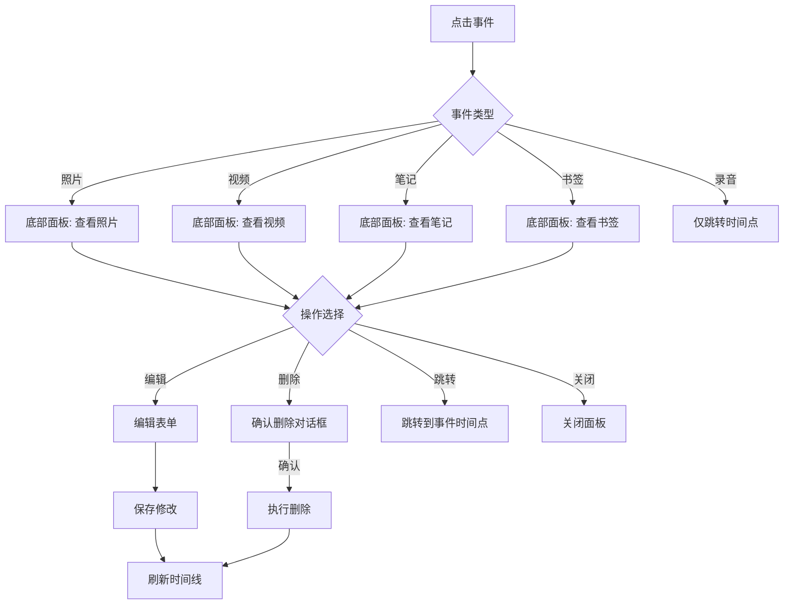
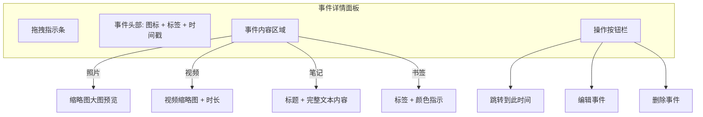
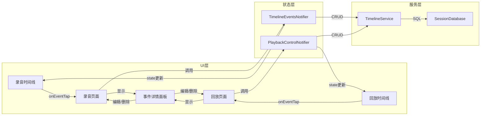

# 时间线事件显示改进与交互增强 — 设计方案

> Author: GDNDZZK
> 日期: 2026-04-29

## 1. 现状分析

### 1.1 录音时间线 (`recording_timeline.dart`)

**布局方式**: `SingleChildScrollView` + `Stack` + `Positioned` 绝对定位，纵向持续延伸。

**事件定位**: 每个事件通过 `_msToY(event.timestamp)` 计算顶部 Y 坐标，固定偏移 `top: y - 12`。

**当前显示模式判定** (第 588-590 行):
```dart
final isCompact = _pixelsPerMs > 0.01;
final isNormal = _pixelsPerMs > 0.002;
```
仅基于全局缩放倍率 `_pixelsPerMs`，不考虑事件之间的实际像素间距。

**问题**:
- 缩放倍率低时（`_pixelsPerMs > 0.01`），所有事件都折叠为紧凑模式，即使相邻事件间距足够大
- 缩放倍率高时（`_pixelsPerMs <= 0.002`），所有事件都显示详细模式，即使会重叠
- 事件没有点击交互（无 `GestureDetector`、无 `onTap` 回调）

### 1.2 回放时间线 (`playback_timeline.dart`)

**布局方式**: `ListView.builder` 列表布局 + `Stack` 录音轨道。

**当前交互**: 事件点击仅触发查看操作：
- 照片 → `OpenFilex.open()` 系统查看器
- 笔记 → `showModalBottomSheet` 只读查看
- 书签 → `showDialog` 查看详情 + 跳转
- 视频 → `OpenFilex.open()` 系统查看器

**问题**: 没有编辑和删除功能。

### 1.3 已有的服务层支持

[`TimelineService`](../lib/services/timeline_service.dart) 已提供：
- `deleteEvent(eventId, type)` — 删除事件（含文件清理）
- `updateTextNote(note)` — 更新笔记
- `updateBookmark(bookmark)` — 更新书签

服务层已具备 CRUD 能力，只需在 UI 层接入。

---

## 2. 重叠检测算法设计

### 2.1 核心思路

将「基于全局缩放阈值」改为「基于事件间实际像素间距」的逐事件决策：

1. 预先计算每个事件在不同显示模式下的估算高度
2. 从最后一个事件向前遍历（或从第一个向后），根据与下一个事件的像素间距决定当前事件的最优显示模式
3. 如果详细模式会与下一个事件重叠，降级为正常模式；如果正常模式也会重叠，降级为紧凑模式

### 2.2 事件高度估算

定义三种显示模式的估算高度：

```dart
/// 事件显示模式
enum EventDisplayMode {
  /// 紧凑：仅图标 + 标签（单行）
  compact,
  /// 正常：图标 + 标签 + 时间（带背景卡片，单行）
  normal,
  /// 详细：图标 + 标签 + 时间 + 内容预览 + 缩略图（多行）
  detailed,
}

/// 根据事件类型和显示模式估算高度（dp）
double estimateEventHeight(TimelineEvent event, EventDisplayMode mode) {
  switch (mode) {
    case EventDisplayMode.compact:
      return 24.0; // 单行：图标14 + 文字11
    case EventDisplayMode.normal:
      return 32.0; // 单行带 padding：图标16 + padding 8*2 + 4
    case EventDisplayMode.detailed:
      double height = 36.0; // 基础行：图标 + 标签 + 时间
      // 文本内容预览
      if (event.textContent != null && event.textContent!.isNotEmpty) {
        height += 60.0; // 3行文本约60dp
      }
      // 缩略图
      if (event.thumbnailPath != null && event.thumbnailPath!.isNotEmpty) {
        height += 70.0; // 64dp缩略图 + 6dp间距
      }
      return height;
  }
}
```

### 2.3 显示模式决策算法

```text
算法：computeDisplayModes(events, pixelsPerMs)

输入：
  events: 按时间戳排序的事件列表
  pixelsPerMs: 当前缩放比例

输出：
  displayModes: 每个事件对应的显示模式列表

步骤：
1. 对每个事件 i，计算其 Y 坐标 y_i = events[i].timestamp * pixelsPerMs
2. 从最后一个事件向前遍历（i = n-1 到 0）：
   a. 如果 i == n-1（最后一个事件），默认使用详细模式
   b. 计算与下一个事件的像素间距：
      gap = y_{i+1} - y_i
   c. 按优先级尝试显示模式：
      - 如果 gap >= estimateHeight(detailed)，选择 detailed
      - 否则如果 gap >= estimateHeight(normal)，选择 normal
      - 否则选择 compact
3. 处理相同时间戳的特殊情况（见 2.4）
```

### 2.4 边界情况处理

#### 多个事件时间戳完全相同

当 `gap == 0` 时，所有同时间戳的事件都使用紧凑模式，并添加微小偏移避免完全重叠：

```dart
// 相同时间戳的事件添加递增偏移
if (i > 0 && events[i].timestamp == events[i - 1].timestamp) {
  yOffset += 26.0; // 每个同时间事件向下偏移一个紧凑模式高度
}
```

#### 事件非常密集的区域

当连续多个事件的间距都小于紧凑模式高度时，使用最小间距保证可读性：

```dart
// 最小间距保证：紧凑模式高度 + 2dp 间距
const double minGap = 26.0;
```

### 2.5 录音时间线的应用

在 [`_buildEventMarkers()`](../lib/widgets/timeline/recording_timeline.dart:560) 中应用：

```dart
List<Widget> _buildEventMarkers(ThemeData theme, ColorScheme colorScheme) {
  final events = _filteredEvents;
  final displayModes = _computeDisplayModes(events);
  
  return List.generate(events.length, (i) {
    final event = events[i];
    final y = _msToY(event.timestamp);
    // ... 累加相同时间戳的偏移
    
    return Positioned(
      top: y - 12 + yOffset,
      left: _eventLeft,
      right: 12,
      child: _buildEventCard(event, theme, colorScheme, displayModes[i]),
    );
  });
}
```

### 2.6 回放时间线的应用

回放时间线使用 `ListView.builder`，事件高度由 `IntrinsicHeight` 自动决定。改进方案：

在 [`_buildTimelineContent()`](../lib/widgets/timeline/playback_timeline.dart:247) 的 `ListView.builder` 中，将 `TimelineZoomLevel` 替换为逐事件的 `EventDisplayMode`：

```dart
itemBuilder: (context, index) {
  final event = widget.events[index];
  final displayMode = displayModes[index];
  
  return TimelineEventItem(
    event: event,
    displayMode: displayMode, // 新参数
    isHighlighted: index == _currentHighlightIndex,
    onTap: () => _handleEventTap(event),
  );
},
```

---

## 3. 事件交互方案设计

### 3.1 交互流程概览



### 3.2 录音时间线事件点击

#### 修改文件: `recording_timeline.dart`

**添加回调参数**:

```dart
class RecordingTimeline extends StatefulWidget {
  final List<TimelineEvent> events;
  final List<RecordingSegment> segments;
  final int totalElapsedMs;
  final ScrollController? scrollController;
  
  // 新增：事件点击回调
  final void Function(TimelineEvent)? onEventTap;
  
  const RecordingTimeline({
    super.key,
    required this.events,
    required this.segments,
    required this.totalElapsedMs,
    this.scrollController,
    this.onEventTap, // 新增
  });
}
```

**事件卡片添加点击**:

在 `_buildEventCard()` 外层包裹 `GestureDetector`：

```dart
Widget _buildEventCard(...) {
  return GestureDetector(
    onTap: () => widget.onEventTap?.call(event),
    child: _buildEventCardContent(event, theme, colorScheme, displayMode),
  );
}
```

#### 修改文件: `record_page.dart`

在 `RecordPage.build()` 中传入 `onEventTap` 回调：

```dart
RecordingTimeline(
  events: events,
  segments: displaySegments,
  totalElapsedMs: totalElapsedMs,
  onEventTap: (event) => _handleEventTap(event), // 新增
),
```

### 3.3 统一事件详情底部面板

创建新组件 `lib/widgets/timeline/event_detail_panel.dart`，用于录音和回放时间线的统一事件详情展示。

#### 面板设计



#### 面板组件接口

```dart
class EventDetailPanel extends StatelessWidget {
  /// 事件数据
  final TimelineEvent event;
  
  /// 跳转回调
  final VoidCallback? onJumpTo;
  
  /// 编辑回调
  final VoidCallback? onEdit;
  
  /// 删除回调
  final VoidCallback? onDelete;
  
  /// 是否显示编辑按钮（录音中不允许编辑）
  final bool canEdit;
  
  /// 是否显示删除按钮
  final bool canDelete;
  
  const EventDetailPanel({
    super.key,
    required this.event,
    this.onJumpTo,
    this.onEdit,
    this.onDelete,
    this.canEdit = true,
    this.canDelete = true,
  });
}
```

#### 面板内容

**照片事件**:
- 缩略图大图预览（`Image.file` 加载 `mediaFilePath` 或 `thumbnailPath`）
- 时间戳
- 操作：用系统查看器打开、删除

**视频事件**:
- 视频缩略图（如有）+ 时长标签
- 时间戳
- 操作：用系统播放器打开、删除

**笔记事件**:
- 标题（如有）
- 完整文本内容（可滚动）
- 操作：编辑、删除

**书签事件**:
- 标签文本
- 颜色指示器
- 时间戳
- 操作：编辑、删除

**录音事件**:
- 录音标签（如 "录音 #1"）
- 录音时长
- 起止时间
- 操作：仅跳转（不可编辑/删除）

### 3.4 编辑功能实现

#### 笔记编辑

弹出底部 Sheet，包含标题输入框和内容输入框：

```dart
void _showEditNoteSheet(TimelineEvent event) {
  final titleController = TextEditingController(text: event.label ?? '');
  final contentController = TextEditingController(text: event.textContent ?? '');
  
  showModalBottomSheet(
    context: context,
    isScrollControlled: true,
    builder: (context) => Padding(
      padding: EdgeInsets.only(
        bottom: MediaQuery.of(context).viewInsets.bottom,
      ),
      child: Column(
        mainAxisSize: MainAxisSize.min,
        children: [
          TextField(controller: titleController, ...),
          TextField(controller: contentController, maxLines: 5, ...),
          Row([
            TextButton('取消'),
            FilledButton('保存', onPressed: () {
              final updatedNote = TextNote(
                id: event.id,
                timestamp: event.timestamp,
                title: titleController.text.trim(),
                content: contentController.text.trim(),
                createdAt: DateTime.now(),
              );
              timelineService.updateTextNote(updatedNote);
              refreshEvents();
              Navigator.pop(context);
            }),
          ]),
        ],
      ),
    ),
  );
}
```

#### 书签编辑

弹出对话框，包含标签输入和颜色选择：

```dart
void _showEditBookmarkDialog(TimelineEvent event) {
  final labelController = TextEditingController(text: event.label ?? '');
  String selectedColor = event.color ?? '#FF6B6B';
  
  showDialog(
    context: context,
    builder: (context) => AlertDialog(
      title: Text('编辑书签'),
      content: Column(
        mainAxisSize: MainAxisSize.min,
        children: [
          TextField(controller: labelController, ...),
          SizedBox(height: 16),
          // 8种预设颜色选择（复用录音页面的颜色选择器）
          Wrap(
            spacing: 8,
            children: presetColors.map((color) => 
              GestureDetector(
                onTap: () => selectedColor = color,
                child: Container(
                  width: 32, height: 32,
                  decoration: BoxDecoration(
                    color: parseColor(color),
                    shape: BoxShape.circle,
                    border: selectedColor == color 
                      ? Border.all(width: 3) 
                      : null,
                  ),
                ),
              ),
            ).toList(),
          ),
        ],
      ),
      actions: [
        TextButton('取消'),
        FilledButton('保存', onPressed: () {
          final updatedBookmark = Bookmark(
            id: event.id,
            timestamp: event.timestamp,
            label: labelController.text.trim(),
            color: selectedColor,
            createdAt: DateTime.now(),
          );
          timelineService.updateBookmark(updatedBookmark);
          refreshEvents();
          Navigator.pop(context);
        }),
      ],
    ),
  );
}
```

### 3.5 删除功能实现

删除操作统一使用确认对话框：

```dart
Future<void> _confirmDeleteEvent(TimelineEvent event) async {
  final confirmed = await showDialog<bool>(
    context: context,
    builder: (context) => AlertDialog(
      title: Text('删除事件'),
      content: Text('确定要删除这个${_getEventTypeName(event.type)}吗？删除后无法恢复。'),
      actions: [
        TextButton(
          onPressed: () => Navigator.pop(context, false),
          child: Text('取消'),
        ),
        FilledButton(
          style: FilledButton.styleFrom(
            backgroundColor: Theme.of(context).colorScheme.error,
          ),
          onPressed: () => Navigator.pop(context, true),
          child: Text('删除'),
        ),
      ],
    ),
  );
  
  if (confirmed == true) {
    await timelineService.deleteEvent(event.id, event.type);
    refreshEvents(); // 刷新时间线
  }
}
```

---

## 4. 需要修改的文件清单

### 4.1 新建文件

| 文件路径 | 说明 |
|---------|------|
| `lib/widgets/timeline/event_detail_panel.dart` | 统一事件详情底部面板组件 |

### 4.2 修改文件

| 文件路径 | 修改内容 |
|---------|---------|
| `lib/widgets/timeline/recording_timeline.dart` | 1. 添加 `onEventTap` 回调参数<br>2. 实现基于间距的重叠检测算法 `_computeDisplayModes()`<br>3. 事件卡片包裹 `GestureDetector`<br>4. 替换固定阈值判定为逐事件显示模式 |
| `lib/widgets/timeline/playback_timeline.dart` | 1. 实现基于间距的重叠检测算法<br>2. 将 `TimelineZoomLevel` 替换为逐事件的 `EventDisplayMode`<br>3. 事件点击弹出详情面板（含编辑/删除） |
| `lib/widgets/timeline/timeline_event_item.dart` | 1. 添加 `EventDisplayMode displayMode` 参数（与 `TimelineZoomLevel` 兼容）<br>2. 根据 `displayMode` 调整显示内容 |
| `lib/pages/record/record_page.dart` | 1. 传入 `onEventTap` 回调<br>2. 添加 `_handleEventTap()` 方法，弹出事件详情面板 |
| `lib/pages/playback/playback_page.dart` | 1. 修改事件点击处理，弹出详情面板（含编辑/删除）<br>2. 添加编辑笔记/书签的方法<br>3. 添加删除事件的确认和执行方法<br>4. 添加事件列表刷新逻辑 |
| `lib/providers/recording_provider.dart` | 1. `TimelineEventsNotifier` 添加 `deleteEvent()` 方法<br>2. 删除后自动刷新事件列表 |
| `lib/providers/playback_provider.dart` | 1. `PlaybackControlNotifier` 添加 `deleteEvent()` 方法<br>2. 添加 `updateTextNote()` 和 `updateBookmark()` 方法<br>3. 操作后自动刷新事件列表 |

---

## 5. 重叠检测算法详细伪代码

```dart
/// 计算每个事件的最优显示模式
///
/// 从最后一个事件向前遍历，根据与下一个事件的像素间距
/// 决定当前事件可以使用的最高显示级别。
List<EventDisplayMode> _computeDisplayModes(List<TimelineEvent> events) {
  if (events.isEmpty) return [];
  
  final n = events.length;
  final modes = List<EventDisplayMode>.filled(n, EventDisplayMode.compact);
  
  // 最后一个事件默认使用详细模式（下方无其他事件）
  modes[n - 1] = EventDisplayMode.detailed;
  
  // 从倒数第二个向前遍历
  for (int i = n - 2; i >= 0; i--) {
    final currentY = _msToY(events[i].timestamp);
    final nextY = _msToY(events[i + 1].timestamp);
    final gap = nextY - currentY;
    
    // 考虑下一个事件的实际占用高度
    final nextHeight = _estimateEventHeight(events[i + 1], modes[i + 1]);
    final availableSpace = gap - nextHeight;
    
    if (availableSpace >= _estimateEventHeight(events[i], EventDisplayMode.detailed)) {
      modes[i] = EventDisplayMode.detailed;
    } else if (availableSpace >= _estimateEventHeight(events[i], EventDisplayMode.normal)) {
      modes[i] = EventDisplayMode.normal;
    } else {
      modes[i] = EventDisplayMode.compact;
    }
  }
  
  return modes;
}

/// 估算事件在指定显示模式下的高度
double _estimateEventHeight(TimelineEvent event, EventDisplayMode mode) {
  switch (mode) {
    case EventDisplayMode.compact:
      return 24.0;
    case EventDisplayMode.normal:
      return 32.0;
    case EventDisplayMode.detailed:
      var h = 36.0;
      if (event.textContent != null && event.textContent!.isNotEmpty) {
        h += 60.0;
      }
      if (event.thumbnailPath != null && event.thumbnailPath!.isNotEmpty) {
        h += 70.0;
      }
      return h;
  }
}
```

### 算法复杂度

- 时间复杂度: O(n)，n 为事件数量
- 空间复杂度: O(n)，存储每个事件的显示模式

### 性能考虑

- 录音时间线：事件数量通常较少（几十个），在 `build()` 中直接计算即可
- 回放时间线：事件可能较多，但算法是线性复杂度，不会成为瓶颈
- 如果事件数量超过 1000，可考虑缓存计算结果，仅在缩放或事件列表变化时重新计算

---

## 6. 边界情况处理

### 6.1 多个事件时间戳完全相同

```dart
// 在 _buildEventMarkers 中处理同时间戳偏移
double yOffset = 0;
for (int i = 0; i < events.length; i++) {
  final event = events[i];
  var y = _msToY(event.timestamp);
  
  // 检测与前一个事件是否同时间戳
  if (i > 0 && events[i].timestamp == events[i - 1].timestamp) {
    yOffset += 26.0; // 每个同时间事件向下偏移
  } else {
    yOffset = 0; // 重置偏移
  }
  
  // 使用 y + yOffset 作为实际定位
}
```

同时间戳的所有事件使用紧凑模式，避免垂直空间浪费。

### 6.2 事件非常密集的区域

当连续事件的间距小于紧凑模式高度（24dp）时：
- 仍然使用紧凑模式
- 添加最小间距保证（2dp），确保视觉上可区分
- 用户可以通过放大（增大 `pixelsPerMs`）来展开密集区域

### 6.3 编辑/删除后时间线的刷新

#### 录音时间线

通过 `TimelineEventsNotifier` 的状态管理：

```dart
// recording_provider.dart
class TimelineEventsNotifier extends StateNotifier<List<TimelineEvent>> {
  // 新增：删除事件
  Future<void> deleteEvent(String eventId, TimelineEventType type) async {
    await _timelineService.deleteEvent(eventId, type);
    // 重新加载事件列表
    final events = await _timelineService.getTimelineEvents();
    if (mounted) state = events;
  }
  
  // 新增：更新笔记
  Future<void> updateTextNote(TextNote note) async {
    await _timelineService.updateTextNote(note);
    final events = await _timelineService.getTimelineEvents();
    if (mounted) state = events;
  }
  
  // 新增：更新书签
  Future<void> updateBookmark(Bookmark bookmark) async {
    await _timelineService.updateBookmark(bookmark);
    final events = await _timelineService.getTimelineEvents();
    if (mounted) state = events;
  }
}
```

#### 回放时间线

通过 `PlaybackControlNotifier` 添加事件操作方法，操作后刷新 `playbackEventsProvider`。

### 6.4 录音事件不可编辑/删除

`TimelineEventType.audio` 类型的事件由录音服务管理，不允许用户手动编辑或删除。在详情面板中隐藏编辑和删除按钮。

### 6.5 照片/视频不可编辑内容

照片和视频没有可编辑的文本内容，仅支持：
- 查看大图/播放视频（系统查看器）
- 删除（含文件清理）

---

## 7. 实现步骤

### 阶段 1: 重叠检测算法

1. 在 `recording_timeline.dart` 中实现 `_computeDisplayModes()` 和 `_estimateEventHeight()` 方法
2. 修改 `_buildEventMarkers()` 使用逐事件显示模式
3. 修改 `_buildEventCard()` 接受 `EventDisplayMode` 参数而非基于全局阈值
4. 处理同时间戳偏移和密集区域

### 阶段 2: 录音时间线事件点击

5. 在 `RecordingTimeline` 添加 `onEventTap` 回调参数
6. 在 `_buildEventCard()` 外层包裹 `GestureDetector`
7. 在 `record_page.dart` 传入 `onEventTap` 回调

### 阶段 3: 统一事件详情面板

8. 创建 `event_detail_panel.dart` 组件
9. 实现各事件类型的详情展示
10. 添加操作按钮（跳转/编辑/删除）

### 阶段 4: 编辑和删除功能

11. 在 `recording_provider.dart` 添加事件编辑/删除方法
12. 在 `playback_provider.dart` 添加事件编辑/删除方法
13. 在 `playback_page.dart` 实现编辑笔记/书签的 UI
14. 在 `playback_page.dart` 实现删除确认和执行
15. 在 `record_page.dart` 实现删除确认和执行

### 阶段 5: 回放时间线重叠检测

16. 在 `playback_timeline.dart` 中实现基于间距的显示模式计算
17. 修改 `TimelineEventItem` 支持 `EventDisplayMode` 参数
18. 更新 `ListView.builder` 使用逐事件显示模式

---

## 8. 数据流图


