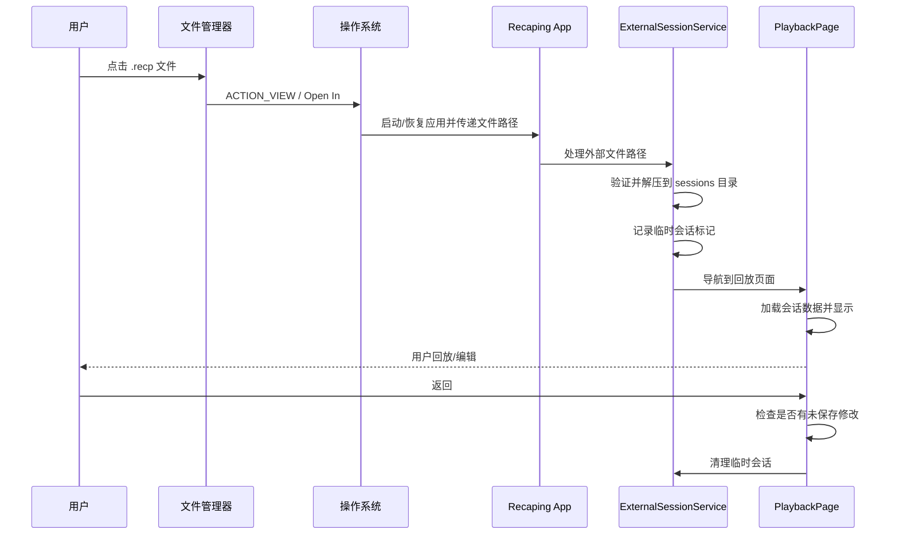
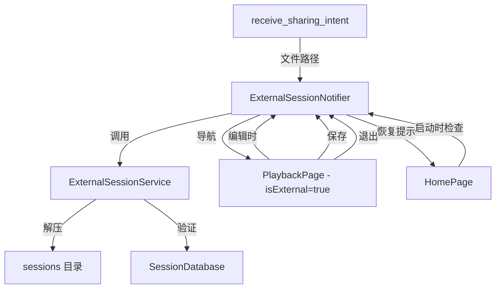
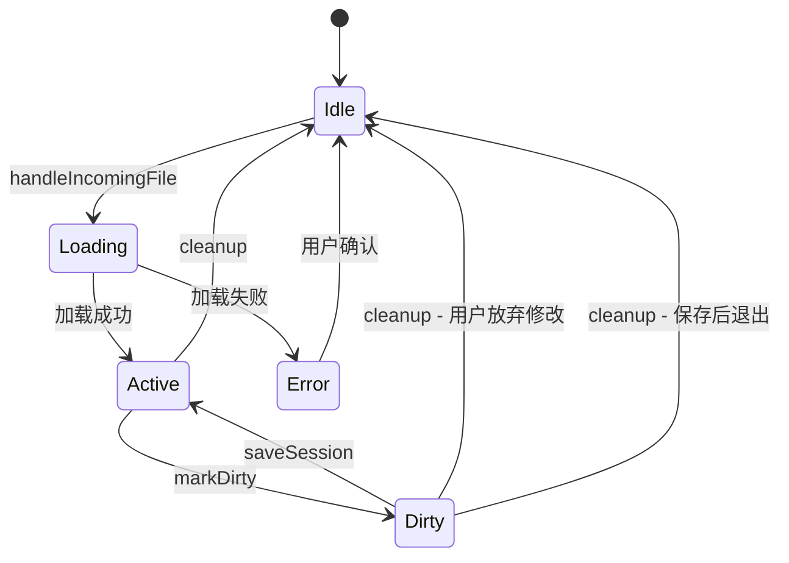

# "打开 .recp 文件"功能架构设计方案

## 1. 概述

### 1.1 功能目标

支持用户从系统文件管理器点击 `.recp` 文件直接打开 Recaping 应用，加载并回放该会话内容。区别于"导入"功能，打开的会话为**临时会话**，不会自动添加到会话列表。

### 1.2 核心设计原则

- **最小侵入**：复用现有 [`ExportService`](lib/services/export_service.dart) 的解压逻辑和 [`PlaybackPage`](lib/pages/playback/playback_page.dart) 的回放逻辑
- **临时会话机制**：利用现有 sessions 目录存储，但不写入 `session_summaries` 表，使其对会话列表不可见
- **平台适配**：Android 通过 Intent Filter，iOS 通过 Document Types 实现文件关联

---

## 2. 整体数据流



---

## 3. 平台配置

### 3.1 Android 配置

修改 [`AndroidManifest.xml`](android/app/src/main/AndroidManifest.xml)，在 `<activity>` 标签内添加 Intent Filter：

```xml
<!-- 在现有 MAIN/LAUNCHER intent-filter 之后添加 -->
<intent-filter>
    <action android:name="android.intent.action.VIEW" />
    <category android:name="android.intent.category.DEFAULT" />
    <category android:name="android.intent.category.BROWSABLE" />
    <data
        android:scheme="content"
        android:host="*"
        android:pathPattern=".*\\.recp"
        android:mimeType="application/octet-stream" />
</intent-filter>
<!-- 备用：通过 mimeType 匹配 -->
<intent-filter>
    <action android:name="android.intent.action.VIEW" />
    <category android:name="android.intent.category.DEFAULT" />
    <data
        android:scheme="content"
        android:mimeType="*/*"
        android:pathPattern=".*\\.recp" />
</intent-filter>
```

**关键点**：
- `android:launchMode="singleTop"` 已配置（见第 21 行），确保不会创建多个 Activity 实例
- 需要处理 `onNewIntent` 以接收后续的文件打开请求
- `content://` URI 需要通过 ContentResolver 复制到本地临时文件后再处理

### 3.2 iOS 配置

修改 [`Info.plist`](ios/Runner/Info.plist)，添加文档类型声明：

```xml
<!-- 在 </dict> 之前添加 -->
<!-- 文件关联：支持打开 .recp 文件 -->
<key>CFBundleDocumentTypes</key>
<array>
    <dict>
        <key>CFBundleTypeName</key>
        <string>Recaping Session</string>
        <key>CFBundleTypeRole</key>
        <string>Viewer</string>
        <key>LSHandlerRank</key>
        <string>Owner</string>
        <key>LSItemContentTypes</key>
        <array>
            <string>com.recaping.recp</string>
        </array>
        <key>CFBundleTypeExtensions</key>
        <array>
            <string>recp</string>
        </array>
    </dict>
</array>
<!-- UTI 声明 -->
<key>UTImportedTypeDeclarations</key>
<array>
    <dict>
        <key>UTTypeIdentifier</key>
        <string>com.recaping.recp</string>
        <key>UTTypeConformsTo</key>
        <array>
            <string>public.data</string>
            <string>public.archive</string>
        </array>
        <key>UTTypeDescription</key>
        <string>Recaping Session File</string>
        <key>UTTypeTagSpecification</key>
        <dict>
            <key>public.filename-extension</key>
            <array>
                <string>recp</string>
            </array>
            <key>public.mime-type</key>
            <array>
                <string>application/x-recaping</string>
            </array>
        </dict>
    </dict>
</array>
```

**关键点**：
- `LSHandlerRank=Owner` 表示 Recaping 是 .recp 文件的主要处理者
- 需要修改 [`AppDelegate.swift`](ios/Runner/AppDelegate.swift) 处理 `application(_:open:options:)` 回调
- iOS 会将文件复制到应用的 `Inbox` 目录，我们需要从那里读取

---

## 4. Flutter 依赖

### 4.1 需要添加的包

| 包名 | 版本 | 用途 |
|------|------|------|
| `receive_sharing_intent` | `^1.5.4` | 统一处理 Android/iOS 的文件打开和分享 Intent |

### 4.2 依赖分析

选择 `receive_sharing_intent` 的原因：
- 同时支持 Android（`ACTION_VIEW` / `ACTION_SEND`）和 iOS（`Open In` / Share Extension）
- 提供文件 URI 流式监听，适合在 `main.dart` 中初始化
- 维护活跃，社区广泛使用

**备选方案**：如果 `receive_sharing_intent` 对 `ACTION_VIEW` 支持不完善，可通过自定义 MethodChannel 补充处理（见第 8 节）。

---

## 5. 新增文件

### 5.1 文件清单

| 文件路径 | 职责 |
|----------|------|
| `lib/services/external_session_service.dart` | 外部会话管理服务：解压、缓存管理、恢复检测、清理 |
| `lib/providers/external_session_provider.dart` | 外部会话状态管理：跟踪临时会话、脏标记、导航触发 |

### 5.2 `ExternalSessionService` 详细设计

```
位置：lib/services/external_session_service.dart

核心职责：
1. openExternalFile(String filePath) → String sessionId
   - 验证 .recp 文件格式（复用 ExportService 的验证逻辑）
   - 解压到 sessions/{sessionId}/ 目录（复用现有目录结构）
   - 不写入 session_summaries 表
   - 在 session.db 的 info 表中添加 is_external=true 标记
   - 返回 sessionId

2. saveExternalSession(String sessionId) → void
   - 将 session 信息写入 session_summaries 表
   - 移除 is_external 标记
   - 会话变为永久会话，出现在会话列表中

3. cleanupExternalSession(String sessionId) → void
   - 删除 sessions/{sessionId}/ 整个目录
   - 清理相关数据库缓存

4. findOrphanedSessions() → List<String>
   - 扫描 sessions 目录
   - 对比 session_summaries 表
   - 返回存在于目录但不在摘要表中的 sessionId 列表

5. isExternalSession(String sessionId) → bool
   - 检查 session.db 的 info 表中 is_external 标记

6. hasUnsavedChanges(String sessionId) → bool
   - 检查 session.db 的 info 表中 is_dirty 标记

7. markDirty(String sessionId) → void
   - 在 session.db 的 info 表中设置 is_dirty=true
```

### 5.3 `ExternalSessionProvider` 详细设计

```
位置：lib/providers/external_session_provider.dart

状态模型：
class ExternalSessionState {
  String? activeSessionId;      // 当前打开的外部会话 ID
  bool isDirty;                  // 是否有未保存的修改
  bool isLoading;                // 是否正在加载
  String? loadingFilePath;       // 正在加载的文件路径
}

Provider 设计：
- externalSessionProvider : StateNotifierProvider<ExternalSessionNotifier, ExternalSessionState>
  - handleIncomingFile(String filePath) → 处理外部文件
  - markDirty() → 标记有修改
  - saveSession() → 保存到会话列表
  - cleanup() → 清理临时会话
  - checkAndRecoverOrphanedSessions() → 检查并恢复孤立会话
```

---

## 6. 修改文件

### 6.1 修改清单

| 文件 | 修改内容 |
|------|----------|
| [`lib/main.dart`](lib/main.dart) | 初始化 `receive_sharing_intent` 监听，接收外部文件 |
| [`lib/app.dart`](lib/app.dart) | 添加 `/playback-external/:sessionId` 路由；在 `RecapingApp` 中监听外部文件事件并导航 |
| [`lib/pages/playback/playback_page.dart`](lib/pages/playback/playback_page.dart) | 添加 `isExternal` 参数；外部模式下显示保存按钮；返回时弹出保存确认 |
| [`lib/pages/home/home_page.dart`](lib/pages/home/home_page.dart) | 启动时检查孤立会话，弹出恢复提示对话框 |
| [`lib/services/export_service.dart`](lib/services/export_service.dart) | 新增 `openExternalSession(String filePath)` 方法，复用解压逻辑但不写入摘要 |
| [`lib/core/constants/app_constants.dart`](lib/core/constants/app_constants.dart) | 添加缓存相关常量 |
| [`android/app/src/main/AndroidManifest.xml`](android/app/src/main/AndroidManifest.xml) | 添加 Intent Filter |
| [`ios/Runner/Info.plist`](ios/Runner/Info.plist) | 添加 CFBundleDocumentTypes 和 UTImportedTypeDeclarations |
| [`ios/Runner/AppDelegate.swift`](ios/Runner/AppDelegate.swift) | 处理 `application(_:open:options:)` 回调 |
| [`pubspec.yaml`](pubspec.yaml) | 添加 `receive_sharing_intent` 依赖 |

### 6.2 详细修改说明

#### 6.2.1 `lib/main.dart`

```dart
// 在 main() 函数中初始化 receive_sharing_intent
void main() {
  WidgetsFlutterBinding.ensureInitialized();
  // 初始化外部文件处理（实际监听在 app.dart 的 RecapingApp 中进行）
  runApp(const RecapingApp());
}
```

#### 6.2.2 `lib/app.dart`

核心修改：
- 添加新路由 `/playback-external/:sessionId`
- 在 `RecapingApp` 的 `initState` 中设置 `receive_sharing_intent` 监听
- 收到外部文件时，调用 `ExternalSessionProvider` 处理并导航

```dart
// 新增路由
GoRoute(
  path: '/playback-external/:sessionId',
  builder: (context, state) => PlaybackPage(
    sessionId: state.pathParameters['sessionId']!,
    isExternal: true,
  ),
),
```

在 `RecapingApp` 中（需改为 StatefulWidget）：
```dart
// 在 initState 中
 ReceiveSharingIntent.instance.getInitialMedia().then(_handleExternalFiles);
 ReceiveSharingIntent.instance.getMediaStream().listen(_handleExternalFiles);

// 处理外部文件
void _handleExternalFiles(List<SharedMediaFile> files) {
  for (final file in files) {
    if (file.path.endsWith('.recp')) {
      // 通过 Provider 处理并导航
      _handleRecpFile(file.path);
    }
  }
}
```

#### 6.2.3 `lib/pages/playback/playback_page.dart`

修改点：
1. 构造函数添加 `isExternal` 参数
2. AppBar 添加保存按钮（仅外部模式）
3. 返回按钮拦截（`PopScope`），检查脏标记
4. 编辑操作时调用 `markDirty()`

```dart
class PlaybackPage extends ConsumerStatefulWidget {
  final String sessionId;
  final bool isExternal;  // 新增

  const PlaybackPage({
    super.key,
    required this.sessionId,
    this.isExternal = false,  // 新增，默认 false
  });
  // ...
}
```

保存按钮位置：在 AppBar 的 actions 中，仅当 `isExternal` 为 true 时显示。

#### 6.2.4 `lib/pages/home/home_page.dart`

修改点：
- 在 `initState` 中调用 `ExternalSessionProvider.checkAndRecoverOrphanedSessions()`
- 如果发现孤立会话，弹出恢复确认对话框

#### 6.2.5 `lib/services/export_service.dart`

新增方法 `openExternalSession`：
```dart
/// 打开外部 .recp 文件为临时会话
///
/// 与 importSession 的区别：
/// - 不检查会话是否已存在（允许覆盖临时会话）
/// - 不写入 session_summaries 表
/// - 在 info 表中标记 is_external=true
Future<String> openExternalSession(String filePath) async { ... }
```

#### 6.2.6 `lib/core/constants/app_constants.dart`

新增常量：
```dart
/// 外部会话标记 key（存储在 session.db 的 info 表中）
static const String infoKeyIsExternal = 'is_external';

/// 外部会话脏标记 key
static const String infoKeyIsDirty = 'is_dirty';
```

---

## 7. 状态管理

### 7.1 Provider 依赖关系



### 7.2 ExternalSessionState 状态机



### 7.3 脏标记追踪

在 `PlaybackPage` 中，以下操作需要标记为脏：
- 编辑标题（`_showEditTitleDialog` 保存时）
- 编辑/删除事件（`_handleEventDetail` 中的编辑和删除操作）

实现方式：在 `PlaybackEventsNotifier` 的修改方法中，检查当前是否为外部会话，如果是则调用 `ExternalSessionNotifier.markDirty()`。

---

## 8. 缓存管理

### 8.1 存储策略

**核心决策**：复用现有 `sessions/` 目录，而非单独的缓存目录。

**原因**：
- 现有 [`SessionDatabase`](lib/core/database/session_database.dart) 和 [`AudioPlaybackService`](lib/services/audio_playback_service.dart) 都依赖 `sessions/{sessionId}/` 路径结构
- 避免修改大量路径解析逻辑
- 通过 `session_summaries` 表的有无来区分临时/永久会话

### 8.2 临时会话标识

在 `session.db` 的 `info` 表中添加标记：

| key | value | 说明 |
|-----|-------|------|
| `is_external` | `true` | 标记为外部打开的临时会话 |
| `is_dirty` | `true`/`false` | 是否有未保存的修改 |

### 8.3 清理策略

| 场景 | 操作 |
|------|------|
| 正常返回（无修改） | 删除 `sessions/{sessionId}/` 目录 |
| 正常返回（有修改，用户选择保存） | 写入 `session_summaries`，移除 `is_external` 标记 |
| 正常返回（有修改，用户选择不保存） | 删除 `sessions/{sessionId}/` 目录 |
| 应用崩溃/被杀 | 下次启动时通过孤立会话检测机制处理 |

### 8.4 孤立会话恢复

在 [`HomePage`](lib/pages/home/home_page.dart) 的 `initState` 中执行：

```
1. 获取 sessions 目录下所有子目录名（即 sessionId 列表）
2. 获取 session_summaries 表中所有 sessionId
3. 差集 = 目录中存在但摘要表中不存在的 sessionId
4. 对差集中的每个 sessionId：
   a. 打开 session.db，检查 is_external 标记
   b. 如果是外部会话，检查 is_dirty 标记
   c. 如果 is_dirty=true，提示用户恢复
5. 用户选择恢复 → 写入 session_summaries
6. 用户选择放弃 → 删除目录
```

---

## 9. UI 交互设计

### 9.1 加载动画

当从外部打开 .recp 文件时，显示全屏加载动画：

```
┌─────────────────────┐
│                     │
│                     │
│    ┌───────────┐    │
│    │  加载中... │    │
│    │  ◠ ◡ ◠    │    │
│    │ 正在打开文件│    │
│    └───────────┘    │
│                     │
│                     │
└─────────────────────┘
```

实现：在 `RecapingApp` 中，当 `ExternalSessionState.isLoading` 为 true 时，在 `MaterialApp` 上层叠加一个加载遮罩层。或者直接在导航到 `PlaybackPage` 前显示一个 `Dialog`。

**推荐方案**：使用 `PlaybackPage` 已有的加载状态（`_isLoading` flag + `CircularProgressIndicator`），无需额外的全局遮罩。文件解压完成后直接导航到 PlaybackPage，其自身的加载动画会显示。

### 9.2 保存按钮

仅在 `isExternal=true` 时在 AppBar 中显示：

```
┌─────────────────────────────────┐
│ ← │ 回放          [💾 保存] [⋮] │
├─────────────────────────────────┤
│                                 │
│         回放内容区域              │
│                                 │
└─────────────────────────────────┘
```

保存按钮行为：
- 点击后调用 `ExternalSessionNotifier.saveSession()`
- 保存成功后 `isExternal` 变为 false，保存按钮消失
- 显示 SnackBar 提示"已保存到会话列表"

### 9.3 退出确认对话框

当用户在 `isExternal=true` 且 `isDirty=true` 时按返回键：

```
┌─────────────────────────┐
│     未保存的修改          │
│                         │
│  您有未保存的修改，       │
│  是否保存到会话列表？     │
│                         │
│  [放弃修改]  [保存]      │
└─────────────────────────┘
```

实现：使用 `PopScope`（WillPopScope 的替代）拦截返回操作。

### 9.4 恢复提示对话框

在 `HomePage` 中检测到孤立会话时弹出：

```
┌─────────────────────────────┐
│     发现未完成的会话          │
│                             │
│  上次打开的文件会话未正常     │
│  关闭，是否恢复？            │
│                             │
│  会话标题: XXX               │
│  创建时间: 2026-05-06        │
│                             │
│  [放弃]  [恢复到会话列表]    │
└─────────────────────────────┘
```

---

## 10. 实现步骤（推荐顺序）

### 阶段一：基础设施

1. 添加 `receive_sharing_intent` 依赖到 [`pubspec.yaml`](pubspec.yaml)
2. 在 [`app_constants.dart`](lib/core/constants/app_constants.dart) 中添加外部会话相关常量
3. 创建 `ExternalSessionService`（`lib/services/external_session_service.dart`）
4. 创建 `ExternalSessionProvider`（`lib/providers/external_session_provider.dart`）

### 阶段二：平台配置

5. 修改 [`AndroidManifest.xml`](android/app/src/main/AndroidManifest.xml) 添加 Intent Filter
6. 修改 [`Info.plist`](ios/Runner/Info.plist) 添加 Document Types
7. 修改 [`AppDelegate.swift`](ios/Runner/AppDelegate.swift) 处理文件打开回调

### 阶段三：核心逻辑

8. 修改 [`export_service.dart`](lib/services/export_service.dart) 添加 `openExternalSession` 方法
9. 修改 [`app.dart`](lib/app.dart) 集成外部文件监听和路由
10. 修改 [`playback_page.dart`](lib/pages/playback/playback_page.dart) 支持外部会话模式

### 阶段四：完善功能

11. 修改 [`home_page.dart`](lib/pages/home/home_page.dart) 添加孤立会话恢复检测
12. 修改 [`playback_provider.dart`](lib/providers/playback_provider.dart) 在编辑操作中标记脏状态

### 阶段五：测试验证

13. 运行 `flutter analyze` 确保无错误
14. Android 端测试：从文件管理器打开 .recp 文件
15. iOS 端测试：从 Files 应用打开 .recp 文件
16. 测试保存、放弃、恢复等场景

---

## 11. 备选方案：自定义 MethodChannel

如果 `receive_sharing_intent` 不能满足需求（特别是 Android 的 `ACTION_VIEW` 场景），可使用自定义 MethodChannel：

### Android 端

修改 [`MainActivity.kt`](android/app/src/main/kotlin/com/recaping/recaping/MainActivity.kt)：

```kotlin
class MainActivity : FlutterActivity() {
    private val CHANNEL = "com.recaping/file_open"
    private var initialFilePath: String? = null
    private var methodChannel: MethodChannel? = null

    override fun configureFlutterEngine(flutterEngine: FlutterEngine) {
        super.configureFlutterEngine(flutterEngine)
        methodChannel = MethodChannel(flutterEngine.dartExecutor.binaryMessenger, CHANNEL)
        methodChannel?.setMethodCallHandler { call, result ->
            when (call.method) {
                "getInitialFile" -> result.success(initialFilePath)
                else -> result.notImplemented()
            }
        }
        // 处理冷启动
        intent?.let { handleIntent(it) }
    }

    override fun onNewIntent(intent: Intent) {
        super.onNewIntent(intent)
        handleIntent(intent)
    }

    private fun handleIntent(intent: Intent) {
        if (intent.action == Intent.ACTION_VIEW) {
            val uri = intent.data ?: return
            // 将 content:// URI 复制到缓存文件
            val file = copyToCache(uri)
            initialFilePath = file?.absolutePath
            methodChannel?.invokeMethod("onFileOpened", initialFilePath)
        }
    }

    private fun copyToCache(uri: Uri): File? {
        // 通过 ContentResolver 读取文件内容并写入缓存
        ...
    }
}
```

### Flutter 端

```dart
// 在 app.dart 中
class _RecapingAppState extends State<RecapingApp> {
  static const _channel = MethodChannel('com.recaping/file_open');

  @override
  void initState() {
    super.initState();
    _setupFileOpenHandler();
  }

  void _setupFileOpenHandler() {
    _channel.setMethodCallHandler((call) async {
      if (call.method == 'onFileOpened') {
        final filePath = call.arguments as String?;
        if (filePath != null) _handleRecpFile(filePath);
      }
    });
    // 检查冷启动时的文件
    _channel.invokeMethod<String>('getInitialFile').then((path) {
      if (path != null) _handleRecpFile(path);
    });
  }
}
```

---

## 12. 风险与注意事项

| 风险 | 影响 | 缓解措施 |
|------|------|----------|
| `receive_sharing_intent` 对 ACTION_VIEW 支持不完善 | 高 | 准备备选 MethodChannel 方案（第 11 节） |
| Android content:// URI 需要异步复制到本地文件 | 中 | 在 Service 层处理，加载动画覆盖等待时间 |
| 大文件解压耗时 | 中 | 显示进度指示器，考虑在临时目录解压后再移动 |
| 同一 .recp 文件多次打开产生冲突 | 低 | 每次打开前检查并清理旧的临时会话 |
| iOS UTI 注册需要 App Store 审核 | 低 | 使用标准 UTI 格式，确保符合 Apple 规范 |
| 并发问题：用户快速连续点击多个 .recp 文件 | 中 | ExternalSessionNotifier 中加锁，忽略处理中的新请求 |
| session.db 中 info 表的 is_external/is_dirty 字段兼容性 | 低 | 使用 key-value 模式存储，无需修改表结构 |

---

## 13. 与现有功能的对比

| 特性 | 导入（现有） | 打开文件（新增） |
|------|-------------|-----------------|
| 入口 | HomePage 导入按钮 | 系统文件管理器 |
| 存储位置 | sessions 目录 | sessions 目录（相同） |
| 写入 session_summaries | ✅ 是 | ❌ 否（除非用户主动保存） |
| 出现在会话列表 | ✅ 是 | ❌ 否（除非保存） |
| 可编辑 | ✅ 是 | ✅ 是 |
| 退出时清理 | ❌ 否 | ✅ 是（未保存时删除） |
| 恢复机制 | ❌ 无 | ✅ 有（孤立会话检测） |
